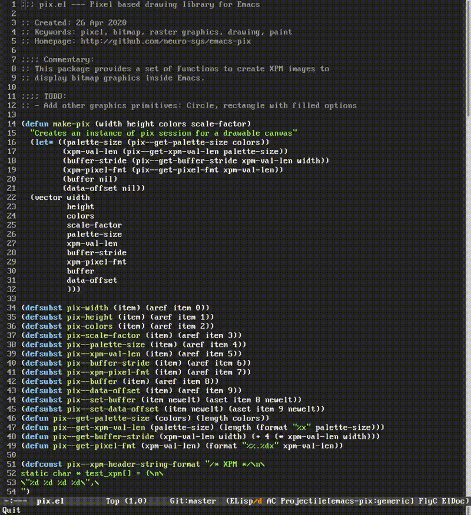

# pix.el
Emacs lisp helper for drawing XPM images and displaying them.

Example usage:

```el
(require 'pix)

(let ((pix-buf (pix-init 320 200 (list '(#x00 #x33 #x66) '(#x00 #xFF #x00)) 2.0)))
  (pix-draw-line pix-buf 30 60 130 20 1)
  (pix-insert pix-buf))
```

## Demo


